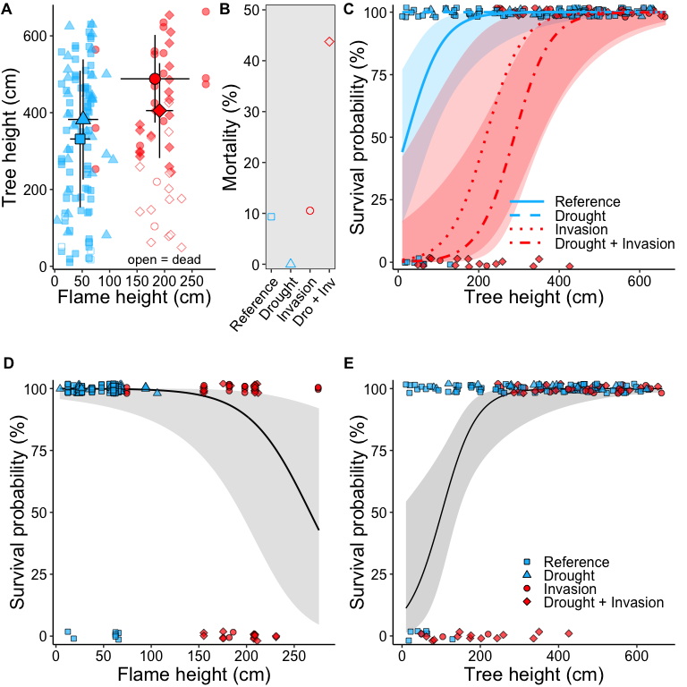

# Interacting global change drivers suppress a foundation tree species

## Abstract
Ecological stress caused by climate change, invasive species, anthropogenic disturbance, and other factors is driving global environmental change. These stressors often occur simultaneously but how they interact to impact native species is poorly understood. We used a longer-term (i.e., six years) field experiment to test how two stressors (drought and invasion by the non-native perennial grass Imperata cylindrica) interacted to determine effects of a third stressor (fire) on longleaf pine (Pinus palustris), the foundation species for a threatened fire-dependent ecosystem in the Southeast USA. Invasion resulted in 65% greater fuel loads, causing over four times taller flames, significantly greater maximum temperatures, and longer heating duration. Invasion combined with prolonged drought also resulted in notably shorter trees than invasion alone, and shorter trees are substantially more vulnerable to mortality due to fire. Consequently, nearly all tree mortality occurred due to a synergistic interaction between fire and the drought + invasion treatment, whereby shorter trees experienced taller flames driven by invasion, resulting in 44% of trees killed by fire. Given average fuel loads in the experiment, modeling predicted that 99% of 2 m tall trees would survive in native vegetation-dominated areas but only 37% of 2 m tall trees would survive in invaded areas due to more intense fires, highlighting an ecosystem-wide benefit of invader prevention and removal. These findings demonstrate that synergy among ecological stressors can result in dramatic impacts on native species, emphasizing that longer-term, multi-factorial, manipulative studies are needed to accurately forecast ecological outcomes of global environmental change.

## Significance statement 

Drivers of global environmental change, such as climate change and invasive species, interact to affect native species. Yet, few experimental studies have realistically tested if these ecological stressors have greater effects together than alone. We evaluated how the combination of plant invasion, drought, and fire affected survival of longleaf pine, a species that defines a threatened Southeast USA ecosystem. The invader generated exceptionally high fuel loads, resulting in more intense fires, including taller flames. As a result, longleaf pine trees that were shorter because they experienced prolonged drought were more likely to die when exposed to invader-fueled fires. These results indicate that understanding how multiple stressors interact to affect native species is necessary to predict effects of global environmental change.
